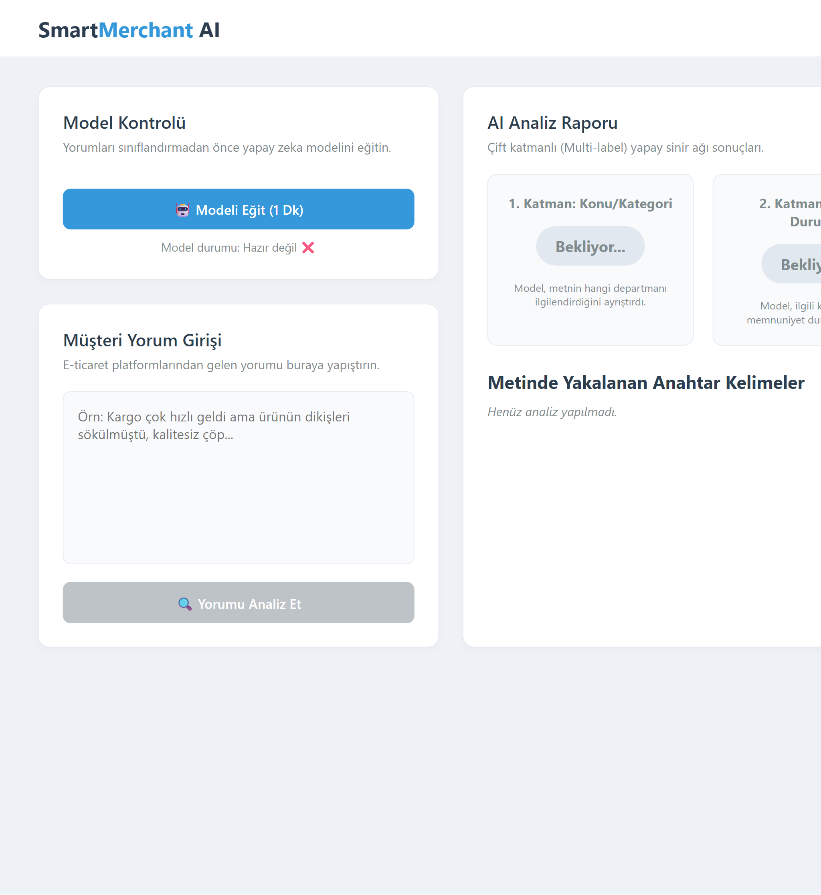

# 📦 SmartMerchant AI - Kelime Yoğunluklu Çift Katmanlı NLP Paneli

SmartMerchant AI, e-ticaret platformlarındaki kullanıcı yorumlarını ve şikayetlerini, istemci tarafında (Client-Side) **TensorFlow.js** mimarisi kullanarak anlık olarak analiz eden tarayıcı tabanlı bir yapay zeka dashboard projesidir.

Proje, klasik cümle ezberleme yöntemleri yerine **Kelime Yoğunluklu Öznitelik Ağırlıklandırması (Keyword-Based Feature Weighting)** kullanarak, daha önce karşılaşılmamış sonsuz varyasyondaki kullanıcı cümlelerinde bile esnek ve doğru tahminler üretir.

---

## 🚀 Öne Çıkan Özellikler

* **Dinamik Mimarili Multi-Label Sınıflandırma:** Tek bir metin girdisinden aynı anda hem ilgili departmanı (Kargo/Ürün) hem de duygu durumunu (Olumlu/Olumsuz) ayrıştırır.
* **Kelime Tabanlı Eğitim (Ölçeklenebilir Yapı):** Model sabit cümle kalıpları yerine; Kargo, Ürün, Pozitif ve Negatif kelime öbeklerinin saf vektör haritaları üzerinden eğitilmiştir. Bu sayede cümle yapısı değişse bile kelime olasılıklarından doğru sonucu bulur.
* **Modüler Veri Yönetimi:** Yapay zeka girdi katmanının referans aldığı 216 kelimelik öznitelik kümesi (`sozluk.json`) asenkron (`async/await`) olarak `fetch` API ile dinamik yönetilir.
* **Bellek Optimizasyonu (`tf.tidy` & `dataSync`):** Arka arkaya yapılan hızlı analizlerde tarayıcı tabanlı bellek sızıntılarını (memory leak) önlemek ve GPU hafızasını pırıl pırıl tutmak için tüm tahmin süreçleri `tf.tidy()` bloğu içinde senkronize yürütülür.

---

## 🛠️ Kullanılan Teknolojiler

* **Frontend:** HTML5, CSS3 (Grid & Flexbox), Vanilla JavaScript (ES6+)
* **Yapay Zeka & NLP:** TensorFlow.js v4.22.0
* **Veri Seti Altyapısı:** Kaggle E-Commerce Review Dataset (`review-emotion-prediction` öznitelik sözlüğü tabanlı)

---

## 📐 Yapay Sinir Ağı Mimarisi

Sistem, Python tarafındaki veri bilimi süreçlerinden (`CountVectorizer`) elde edilen kelime sözlüğünü girdi katmanı kabul eden ardışık (`tf.sequential`) bir yapay sinir ağı kullanır:

* **Girdi Katmanı (Input Layer):** `sozluk.json` uzunluğu kadar (216) nöron (`relu` aktivasyon fonksiyonu)
* **Çıkış Katmanı (Output Layer):** Çift katmanlı olasılık hesabı için 4 nöron (`sigmoid` aktivasyon fonksiyonu) -> `[Kargo, Ürün, Pozitif, Negatif]`
* **Kayıp Fonksiyonu (Loss):** `binaryCrossentropy`
* **Optimizasyon:** `adam`
* **Eğitim Döngüsü:** 150 Epoch

---

## 💻 Kurulum ve Çalıştırma

Projede `sozluk.json` dosyası üzerinden dinamik veri transferi (`fetch`) yapıldığı için tarayıcıların CORS güvenlik politikasını aşmak adına projenin yerel bir sunucu (Local Server) üzerinden çalıştırılması gerekmektedir.

1. Bu repoyu bilgisayarınıza indirin veya klonlayın.
2. Proje klasörünü **VS Code** ile açın.
3. **Live Server** uzantısını kullanarak `index.html` dosyasını ayağa kaldırın.
4. Arayüzdeki **"🤖 Modeli Eğit"** butonuna sayfa başında **sadece 1 kere** basarak yapay sinir ağını canlı olarak eğitin.
5. Ardından müşteri yorum girişi alanına dilediğiniz yorumu yazıp **"🔍 Yorumu Analiz Et"** butonuyla arka arkaya sonsuz analiz yapmaya başlayın!